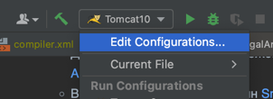

# Currency Exchange
Реализация проекта обмена валют:
https://zhukovsd.github.io/java-backend-learning-course/Projects/CurrencyExchange/
## Описание
Проект представляет собой серверное приложение, предоставляющее доступ к методам создания, чтения, обновления и удаления
(CRUD) сущностей связанных с валютами и их курсами относительно друг друга. Проект создан в образовательных целях
## Стэк
 - Java (Jakarta Servlet API)
 - SQLite
 - Tomcat 10
## Локальный запуск из IDE
 1. IntelliJ Idea (CE):
    * Для локального запуска приложения потребуется скачать [Apache Tomcat 10](https://tomcat.apache.org/download-10.cgi)
    * В Intellij Idea установить плагин [Smart Tomcat](https://plugins.jetbrains.com/plugin/9492-smart-tomcat)
    * После утсановки плагина должна появиться настройка Settings -> Tomcat Server. Необходимо добавить скачанный Tomcat,
    нажав + (Add) и в проводнике указать скачанный сервер
    >
    * Далее необходимо добавить конфигурацию запуска, нажав Edit Configuration
    >
    >
    Добавить новую конфигурацию нажав + (Add)
    > 
    > 
    В выпавшем списке выбрать Smart Tomcat
    >
    > 
    В окне настройки необходимо (по желанию) изменить название
    и указать в качестве Deployment Directory папку webapp (может выставиться по умолчанию)
    > 
    >
    Далее запуск приложения из IDE осуществляется как обычно
    > 